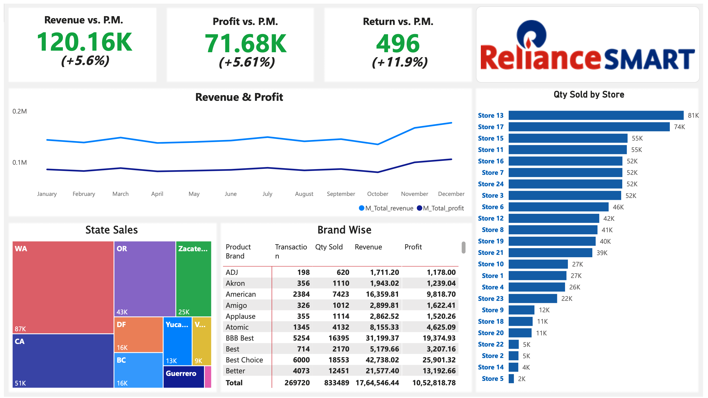

# PowerBI Reliance Smart Project



## Project Overview
This project is designed to demonstrate advanced Power BI skills and showcase the ability to handle data from multiple sources, perform complex transformations, and create insightful dashboards. It highlights the use of DAX calculations, data modeling, and visualization to generate meaningful insights for retail operations. The project aims to improve proficiency in Power BI while addressing real-world business scenarios.

## Data Model


## Project Steps

### 1. Data Loading and Transformation
- **Load Customer File**:
  - Check all data types of columns.
  - Create a `Full Name` column from `First Name` and `Last Name`.
  - Create a `Birth Year` column from the `Birthdate` column.
  - Create a `Has Child` column using conditional logic.

- **Load Products File**:
  - Create a `Discounted Price` column with 90% of `Product Retail Price`.
  - Create a `Round` column from `Discounted Price` with two decimals.

- **Load Store, Regions, and Calendar Files**:
  - Change the date format to US standards.
  - Create columns from the date column:
    - Start of Week
    - Day Name
    - Start of Month
    - Month Name
    - Quarter
    - Year

- **Load Returns and Transactions Files**:
  - Load `Returns_1997_1998` file.
  - Load a folder containing `Transactions` files.

### 2. Data Modeling
- Perform data modeling and establish relationships.
- Hide unnecessary columns to prevent mistakes during analysis.

### 3. DAX (Data Analysis Expressions)
#### Calculated Columns

- **Calendar Table**:
  - `Weekend`: Identify if the day is a weekend.
    ```DAX
    weekend = IF(OR(d_Calendar[Day Name] = "Saturday", d_Calendar[Day Name] = "Sunday"), "Y", "N")
    ```

- **Customer Table**:
  - `Age`: Calculate age from the `Birth Year`.
    ```DAX
    Age = YEAR(TODAY()) - d_Customers[Birth_year]
    ```
  - `Priority`: Set priority based on homeowner and golden membership status.
    ```DAX
    Priority = IF(d_Customers[homeowner] = "Y" && d_Customers[member_card] = "Golden", "High", "Standard")
    ```

#### Measures
Create a new table to consolidate all measures.

- `Sold Qty`:
  ```DAX
  M_Qty_sold = SUM(f_Transactions[quantity])
  ```

- `Returned Qty`:
  ```DAX
  M_Qty_returned = SUM('f_Returns-1997-1998'[quantity])
  ```

- `Total Transaction`:
  ```DAX
  M_Total_transactions = COUNTA(f_Transactions[transaction_date])
  ```

- `Total Returns`:
  ```DAX
  M_Total_returns = COUNTA('f_Returns-1997-1998'[return_date])
  ```

- `Weekend Transactions`:
  ```DAX
  M_Weekend_transaction = CALCULATE([M_Total_transactions], d_Calendar[weekend] = "Y")
  ```

- `All Transactions`:
  ```DAX
  M_All_transaction = CALCULATE([M_Total_transactions], ALL(f_Transactions))
  ```

- `All Returns`:
  ```DAX
  M_All_returns = CALCULATE([M_Total_returns], ALL('f_Returns-1997-1998'))
  ```

- `Total Revenue`:
  ```DAX
  M_Total_revenue = SUMX(f_Transactions, f_Transactions[quantity] * RELATED(d_Products[product_retail_price]))
  ```

- `Total Cost`:
  ```DAX
  M_Total_cost = SUMX(f_Transactions, f_Transactions[quantity] * RELATED(d_Products[product_cost]))
  ```

- `Total Profit`:
  ```DAX
  M_Total_profit = [M_Total_revenue] - [M_Total_cost]
  ```

- `Profit Margin`:
  ```DAX
  M_Profit_margin = [M_Total_profit] / [M_Total_revenue]
  ```

- `Unique Products`:
  ```DAX
  M_Unique_products = DISTINCTCOUNT(d_Products[product_id])
  ```

- `Year-to-Date Revenue`:
  ```DAX
  M_YTD_revenue = CALCULATE([M_Total_revenue], DATESYTD(d_Calendar[date]))
  ```

- `Previous Month Metrics`:
  - Transactions:
    ```DAX
    M_Previous_month_transaction = CALCULATE([M_Total_transactions], PREVIOUSMONTH(d_Calendar[date]))
    ```
  - Revenue:
    ```DAX
    M_Previous_month_revenue = CALCULATE([M_Total_revenue], PREVIOUSMONTH(d_Calendar[date]))
    ```
  - Profit:
    ```DAX
    M_Previous_month_profit = CALCULATE([M_Total_profit], PREVIOUSMONTH(d_Calendar[date]))
    ```
  - Returns:
    ```DAX
    M_Previous_month_returns = CALCULATE([M_Qty_returned], PREVIOUSMONTH(d_Calendar[date]))
    ```

---

